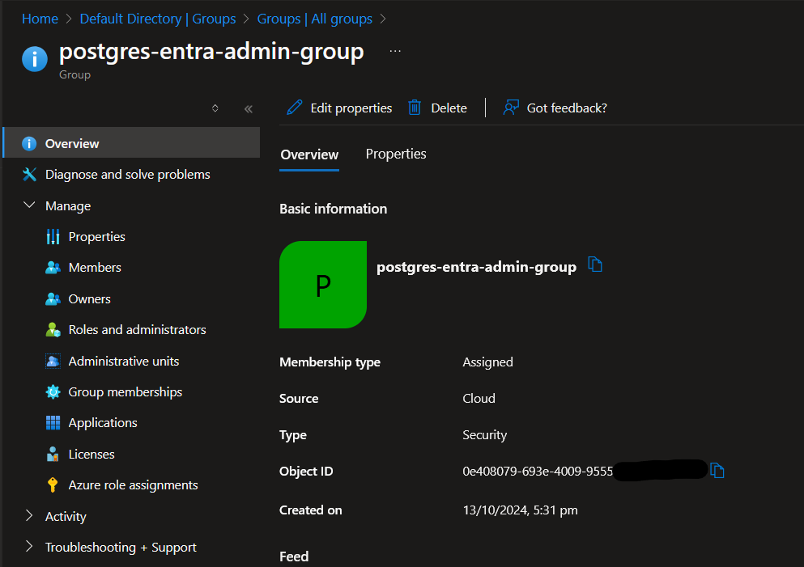
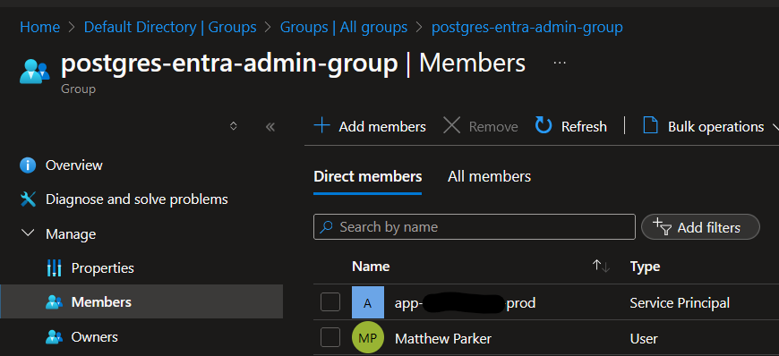

The MS Learn docs don't specifically cover this use case, so I hope this is useful for anyone attempting similar.

#### Using
- Azure Database for PostgreSQL - Flexible Server
- Azure App Service
- Bicep
- ASP.NET Core
- EF Core (Entity Framework Core)

#### Scenario
I have an ASP.NET Core app running in an Azure App Service that needs to connect with EF Core to an `Azure Database for PostgreSQL - Flexible Server`. I want to use a System Assigned Managed Identity to authenticate the web app to the database, as I'd like to avoid using passwords/secrets. Typically, this is easy in similar scenarios, such as connecting to Azure Blob Storage - just assign the required role to the App Service's Managed Identity, and it all works. However, it's not that easy with Azure PostgreSQL.

Here are some of the relevant MS Learn docs for reference:
* [Connect with managed identity to Azure Database for PostgreSQL - Flexible Server](https://learn.microsoft.com/en-us/azure/postgresql/flexible-server/how-to-connect-with-managed-identity)
* [Use Microsoft Entra ID for authentication with Azure Database for PostgreSQL - Flexible Server](https://learn.microsoft.com/en-us/azure/postgresql/flexible-server/how-to-configure-sign-in-azure-ad-authentication)

#### Problems and Solutions

##### Problem 1: Figuring out the Bicep to deploy the database, with managed identity access 🥁🎺:


```
resource postgresFlexibleServer 'Microsoft.DBforPostgreSQL/flexibleServers@2023-12-01-preview' = {
  location: location
  name: 'psql-${applicationName}-${environment}'
  sku: {
    name: 'Standard_B1ms'
    tier: 'Burstable'
  }
  identity: {
    type: 'SystemAssigned'
  }
  properties: {
    createMode: 'Default'
    version: '16'
    network: {
      publicNetworkAccess: 'Enabled'
    }
    highAvailability: {
      mode: 'Disabled'
    }
    backup: {
      backupRetentionDays: 7
      geoRedundantBackup: 'Disabled'
    }
    authConfig: {
      activeDirectoryAuth: 'Enabled'
      passwordAuth: 'Disabled'
    }
    storage: {
      type: 'PremiumV2_LRS'
      storageSizeGB: 32
      iops: 3000
      throughput: 125
      autoGrow: 'Disabled'
    }
  }
}
```

When setting up the PostgreSQL server, you need to enable Entra ID authentication - set `authConfig.activeDirectoryAuth` to `Enabled`. I don't want to deal with passwords, so I'm disabling password authentication - set `authConfig.passwordAuth` to `Disabled`. Curiously, when I tried creating this postgres flexible server resource in the Azure Portal, the creation immediately failed, stating that the admin username was required, despite me selecting 'Entra ID Authentication Only'. This bug/limitation doesn't seem to affect Bicep deployments.

If you try doing this in the Azure Portal, you'll notice that when selecting Entra Id Auth, you must supply an Entra ID person/group/entity (object ID). It feels different to how ownership/management is handled in other Azure resources, but 🤷‍♂️. I'm going to create a group, as we will have multiple objects within this group.

Create a group like this:



Take note of the Object ID. Let's add it to the Bicep file:

```
// ...[previous code]...

resource postgresFlexibleServerEntraAdministrator 'Microsoft.DBforPostgreSQL/flexibleServers/administrators@2023-12-01-preview' = {
  parent: postgresFlexibleServer
  name: '0e408079-693e-4009-9555-xxxxxxxxxxxx'
  properties: {
    principalName: postgresFlexibleServerEntraAdminGroupName
    principalType: 'Group'
  }
}
```

We also need a system-assigned managed identity for the App Service. This is done by adding the `identity` property to the Bicep file:

```
resource appService 'Microsoft.Web/sites@2022-09-01' = {
  name: 'app-${applicationName}-${environment}'
  location: location
  identity: {
    type: 'SystemAssigned'
  }
  properties: {
    ...
  }
}
```

This yields an object ID that we can give access to the database (by adding them to the Entra ID group we created earlier).



Now that our App Service has access to the database, we can move on to the next problem.

##### Problem 2: Connecting to the database from the EF Core

Firstly, here is your connection string:

`Host={{AZURE POSTGRES RESOURCE NAME}}.postgres.database.azure.com;Database={{YOUR CHOICE}};Username=postgres-entra-admin-group;`

**Note**: the username is the name of the Entra ID group, and, no password needed! We will need to figure out how to authenticate using the Managed Identity.

Assuming you are using `Npgsql.EntityFrameworkCore.PostgreSQL` (I'm using 8.0.8 for reference), your existing EF Core setup code probably looks similar to this:

```csharp
var databaseConfig = configuration.GetSection(nameof(DatabaseConfig)).Get<DatabaseConfig>();
services.AddNpgsql<AppDbContext>(databaseConfig!.ConnectionString);
```
We'll come back to this.

Using our managed identity, we can generate an access token granting access to Azure resources. Add the `Azure.Identity` package to your project (I'm using 1.12.1).

This access token needs to be supplied as the password in the connection to the postgres database. (Alarm bells may be going off in your head, because... don't access tokens expire?) Yes they do, and the MS Learn docs don't mention handling this.

But one step at a time. Let's add the code to get the access token, and supply it to the database connection:

```csharp
var databaseConfig = configuration.GetSection(nameof(DatabaseConfig)).Get<DatabaseConfig>();
var credential = new DefaultAzureCredential(); // This is from the Azure.Identity package
var tokenResult = await credentials.GetTokenAsync(new TokenRequestContext(["https://ossrdbms-aad.database.windows.net/.default"]));
var token = tokenResult.Token;
```

We could now use this token as the password in the connection string, but we need to handle token expiry. Lucky for us, we have this wonderful but also poorly documented method called `UsePeriodicPasswordProvider`. This is called on the class `NpgsqlDataSourceBuilder`, which then needs to be built, and somehow supplied to EF Core. (Also very undocumented).

```csharp
var databaseConfig = configuration.GetSection(nameof(DatabaseConfig)).Get<DatabaseConfig>();
var dataSourceBuilder = new NpgsqlDataSourceBuilder(databaseConfig!.ConnectionString);
if (dataSourceBuilder.ConnectionStringBuilder.Password is null) // lets us supply a password locally, bypassing this expiry handling
{
    var credentials = new DefaultAzureCredential();
    dataSourceBuilder.UsePeriodicPasswordProvider(
        async (_, ct) =>
        {
            // This specific context must be used, to get a token to access the postgres database
            var token = await credentials.GetTokenAsync(new TokenRequestContext(["https://ossrdbms-aad.database.windows.net/.default"]), ct);
            return token.Token;
        },
        TimeSpan.FromHours(23), // successRefreshInterval - gets a new token every 23 hours
        TimeSpan.FromSeconds(10) // failureRefreshInterval - retries after 10 seconds if a token retrieval fails
    );
}
var dataSource = dataSourceBuilder.Build();
services.AddDbContext<AppDbContext>(options => options.UseNpgsql(dataSource));
```
Of Note:
* access tokens for a Service Principal (the type of identity an Azure App Service receives) last for 24 hours.
* we can no longer use `.AddNpgsql<AppDbContext>(databaseConfig!.ConnectionString)`, as there is no overload taking an `NpgsqlDataSource`. Instead we use `.AddDbContext<AppDbContext>(options => options.UseNpgsql(dataSource));`, which `.AddNpgsql(...)` simply wraps anyway.

Honourable mention:
* As I was writing this, I moved the `var credentials = new DefaultAzureCredential();` outside of the Func supplied to UsePeriodicPasswordProvider, to avoid it being instantiated every time the Func is called, but given that it is happening every 23 hours, it seems like a micro-optimisation at best 😅.

#### Success!

That should be it! I hid the above code in a new extension method `services.AddCustomisedNpgsql(configuration);`, so I can pretend it doesn't exist from now on.